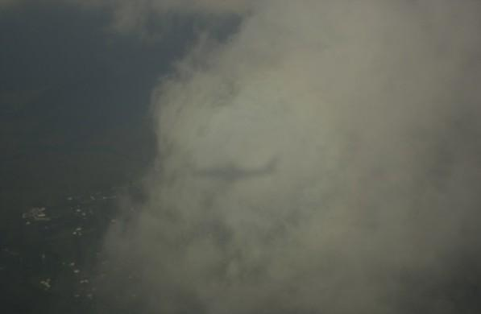
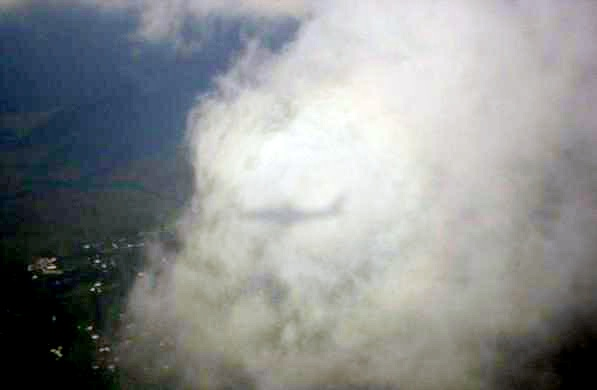
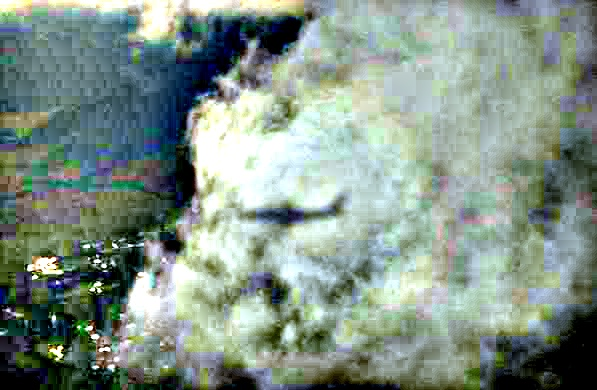

# Retinex Image Enhancement
Retinex is the theory of human color vision proposed by Edwin Land to account for color sensations in real scenes.

Retinex model is
based on the following three assumptions:
- 1. The real world is colorless, and the color we perceive is the result of the interaction
of light and matter. The water we see is colorless, but the water film-soap film is
colorful, which is the result of light interference on the surface of the film.
- 2. Each color region is composed of three primary colors of red, green and blue of a
given wavelength;
- 3. The three primary colors determine the color of each unit area.

The basic theory of Retinex theory is that the color of an object is determined by the
ability of the object to reflect light in long (red), medium (green), and short (blue) light,
rather than by the absolute value of the intensity of the reflected light. The color of the
object is not affected by the illumination non-uniformity, and the retinex is based on the
consistency of color perception (color constancy). Unlike traditional linear and nonlinear
methods that only enhance a certain type of image, Retinex can balance dynamic range
compression, edge enhancement and color constancy, so it can adapt to different types of
image enhancement.


## Environment and Library Installation
The project script is implemented in python 3, with openCV and numpy libraries.
Use the package manager [pip](https://pip.pypa.io/en/stable/) to install openCV and numpy. Copy paste the following commands in your terminal/power shell one after the other.

```bash
pip install opencv-python
```
```bash
pip install numpy
```
## Mode of Approach
The image is first imported into script for processing.
Then two functions for multiscale and single scale retinex algorithms using spatial filters
are implemented. If the original image is a grayscale image: the gray value of each pixel of
the image is converted from an integer (int) to a floating point (float), and converted to a
logarithmic domain, If the original image is a color map: the color is divided into channels,
each component pixel value is converted from an integer (int) to a floating point (float) and
converted to a logarithmic domain. Then the log domain is converted into real domain for
further image processing and the image is displayed.

## Results







## Contributing
Pull requests are welcome. For major changes, please open an issue first to discuss what you would like to change.


## License
The [MIT](https://choosealicense.com/licenses/mit/) License

Permission is hereby granted, free of charge, to any person obtaining a copy of this software and associated documentation files (the "Software"), to deal in the Software without restriction, including without limitation the rights to use, copy, modify, merge, publish, distribute, sub license, and/or sell copies of the Software, and to permit persons to whom the Software is furnished to do so.

THE SOFTWARE IS PROVIDED "AS IS", WITHOUT WARRANTY OF ANY KIND, EXPRESS OR IMPLIED, INCLUDING BUT NOT LIMITED TO THE WARRANTIES OF MERCHANTABILITY, FITNESS FOR A PARTICULAR PURPOSE AND NON INFRINGEMENT. IN NO EVENT SHALL THE AUTHORS OR COPYRIGHT HOLDERS BE LIABLE FOR ANY CLAIM, DAMAGES OR OTHER LIABILITY, WHETHER IN AN ACTION OF CONTRACT, TORT OR OTHERWISE, ARISING FROM, OUT OF OR IN CONNECTION WITH THE SOFTWARE OR THE USE OR OTHER DEALINGS IN THE SOFTWARE.
